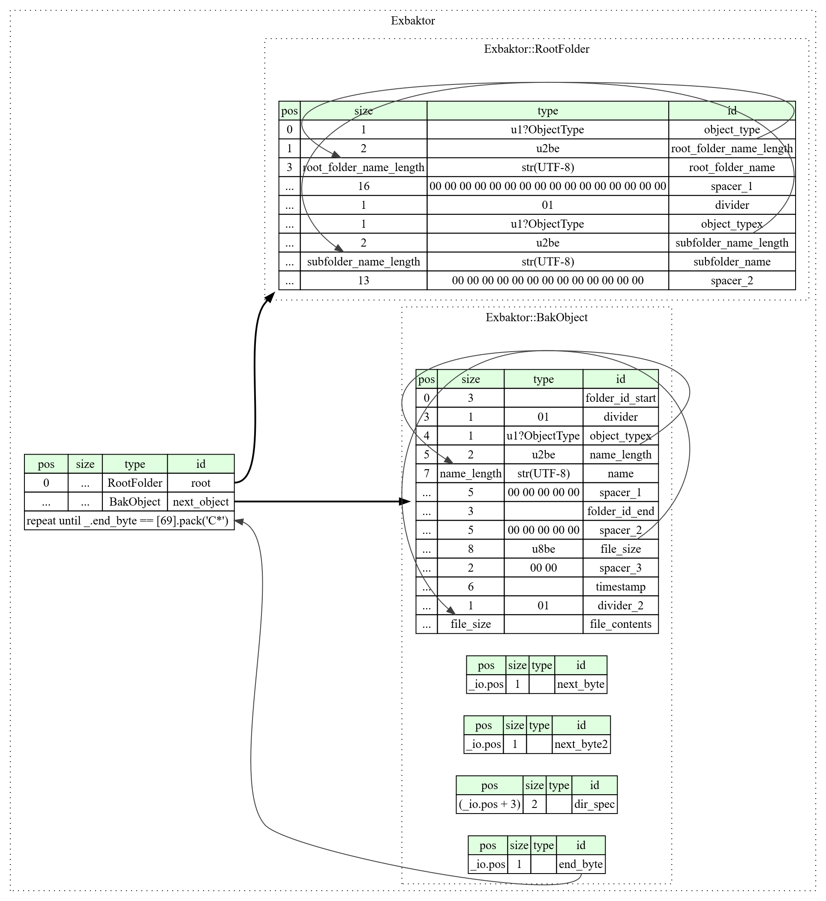

# Clearwell backup extractor
Extract contents of the proprietary Clearwell (Veritas) .BAK file format


### `exbak.py` - Script to extract .BAK files


### `format.ksy` - [Kaitai Struct](https://kaitai.io/) format definition

If you want to interactively inspect the file format structure using [Kaitai Web IDE](https://ide.kaitai.io/), you first need to inflate the .BAK files.

You can use the following code to do that:
```python
import os
import zlib

folder_path = '\path\to\folder\with\BAK files'

for file in os.listdir(os.path.abspath(folder_path)):
	filename = os.path.basename(file)
	if filename.endswith('.bak'): 
		print('Processing ' + filename)
		with open(os.path.join(folder_path, filename), 'rb') as f:
			hexdata = f.read().hex()
		deflated_hex = hexdata[hexdata.find('2e62616b7801')+12:] # remove .BAK file header (everything up to '.bakx.' in hex)
		deflated_bytes = bytes.fromhex(deflated_hex)
		inflated_bytes = zlib.decompress(deflated_bytes, -15) # inflate the rest of the file in the 'no headers' mode
		with open(os.path.join(folder_path, filename)[:-4] + '.dat', 'wb') as f:
			f.write(inflated_bytes)
```

#### File format diagram

